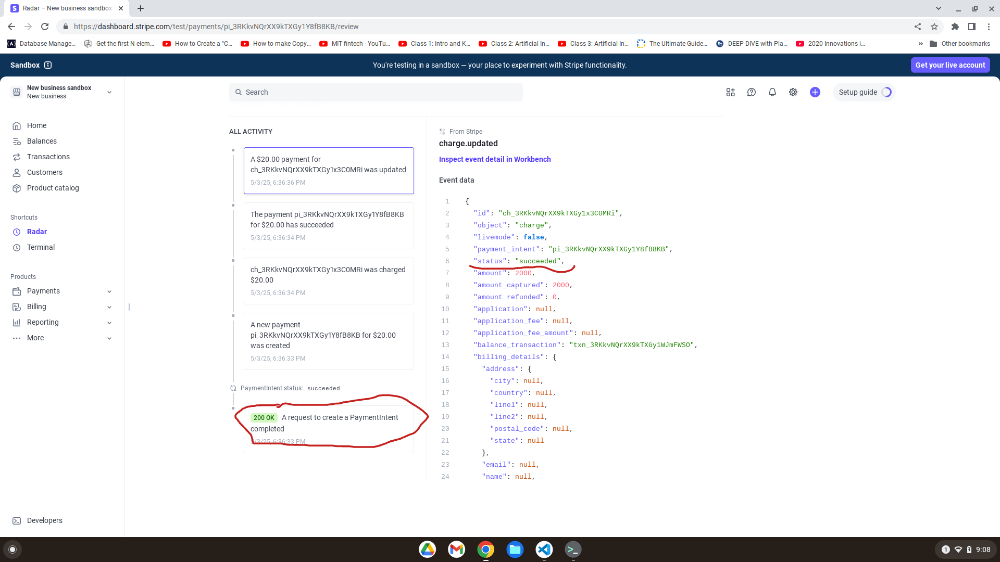

# Stripe Webhooks Learning Project

This project demonstrates how to set up and securely handle Stripe webhooks using Python and Flask. It is part of a broader learning path focused on financial APIs, authentication flows, and event-driven architecture.

## Features

- Webhook endpoint built with Flask
- Secure signature verification using Stripe SDK
- Stripe CLI integration for event simulation
- Example of event data consumption logic
- Fully tested locally and confirmed via Stripe Dashboard 

## Preview  

Here's an example of a successfully received webhook event in the Stripe Dashboard:  



## How to Use

1. **Install dependencies**  
   ```bash
   pip install -r requirements.txt

2. Run the Flask app

flask run


3. Start Stripe CLI to forward events

stripe listen --forward-to localhost:5000/webhook


4. Simulate an event

stripe trigger payment_intent.succeeded


Security

Webhook signatures are verified using Stripe’s signing secret.

Replay and spoofing attacks are mitigated using Stripe's HMAC signature validation.


Purpose

This is a learning project intended to gain practical experience with:

Webhooks

Event-driven API design

Stripe’s developer tools


License

MIT License
